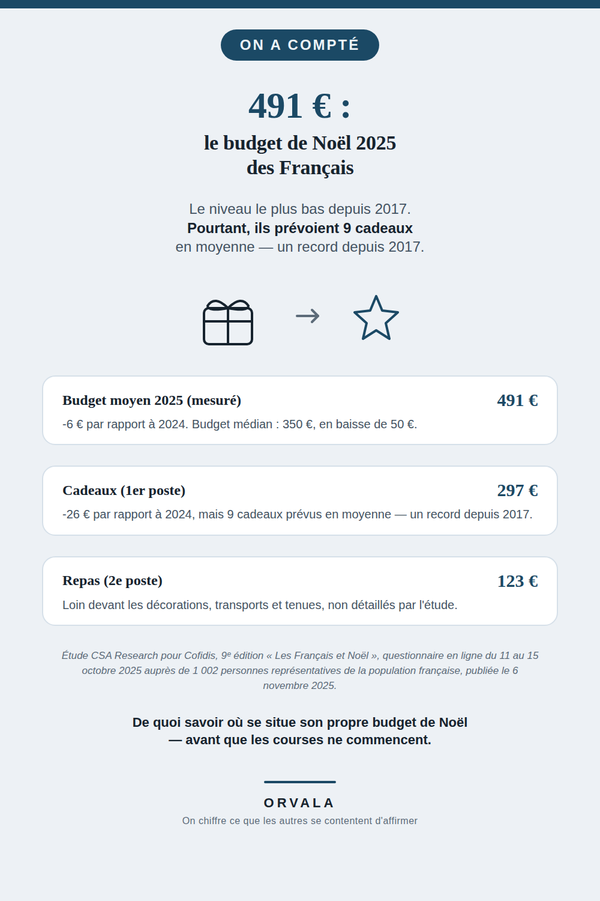

SHA: e6c9c9704fa3e5f1900cb03b89ef147aed930ab3
# Combien coûte Noël ?

**491 €** : c'est le budget moyen que les Français prévoyaient pour Noël 2025 — le niveau le plus
bas depuis 2017, alors même qu'ils prévoyaient **9 cadeaux** en moyenne, un record depuis 2017.

## La décomposition

| Poste | Chiffre |
|---|---|
| Budget moyen 2025 | **491 €** (-6 € vs 2024, plus bas depuis 2017) |
| Budget médian 2025 | **350 €** (-50 € vs 2024) |
| Cadeaux (1er poste) | **297 €** (-26 € vs 2024) |
| Nombre de cadeaux prévus | **9** en moyenne (record depuis 2017) |
| Repas (2e poste) | **123 €** |
| Décorations, transports, tenues | non détaillés individuellement par l'étude |

## La source

Étude **CSA Research pour Cofidis**, 9ᵉ édition « Les Français et Noël », questionnaire
auto-administré en ligne du **11 au 15 octobre 2025**, échantillon de **1 002 personnes** de 18
ans et plus représentatif de la population française (quotas sexe / âge / profession / région /
catégorie d'agglomération), publiée le **6 novembre 2025**.

Pages source vérifiées directement :
- https://www.cofidis.fr/fr/question-de-budget/projets-des-francais/budget-francais-noel-2025.html
- https://csa.eu/news/les-francais-et-noel-2025/ (page de l'institut de sondage lui-même)

Aucun chiffre de ce document n'a été recalculé ou extrapolé : ils sont recopiés tels que publiés
par l'institut. Les postes décorations/transports/tenues ne sont pas détaillés individuellement
dans l'étude — ce dépôt ne leur invente donc aucun montant.

## Un chiffre officiel complémentaire : la Prime de Noël

Il existe une aide d'État qui porte exactement ce nom, mais elle ne s'adresse pas au même public
que le budget de 491 € ci-dessus. Vérifié directement sur **info.gouv.fr** (« Prime de Noël 2025 :
montant, date de versement et bénéficiaires », publié le 3 décembre 2025) :

| Situation | Montant |
|---|---|
| Bénéficiaire du RSA, personne seule | **152,45 €** |
| Bénéficiaire du RSA, couple sans enfant ou personne seule avec 1 enfant | **228,68 €** |
| Bénéficiaire du RSA, couple avec 1 enfant ou personne seule avec 2 enfants | **274,41 €** |
| Bénéficiaire du RSA, couple avec 2 enfants | **320,15 €** |
| Majoration par enfant supplémentaire | **+ 60,98 €** |
| Bénéficiaire de l'ASS ou de l'AER (forfait unique, quel que soit le foyer) | **152,45 €** |

Versée automatiquement (aucune démarche à faire) à partir du **16 décembre 2025**, par la CAF pour
le RSA, la MSA pour les allocataires agricoles, et France Travail pour l'ASS/l'AER. Non imposable.

**Ce chiffre ne se soustrait pas au budget de 491 €** : ce n'est pas une aide versée à tous les
ménages qui fêtent Noël, mais une aide exceptionnelle réservée aux bénéficiaires de minima sociaux
(RSA, ASS, AER), pensée pour soutenir leur pouvoir d'achat aux fêtes — pas pour financer le budget
cadeaux/repas moyen mesuré par l'étude CSA/Cofidis ci-dessus. Les deux chiffres cohabitent sans se
comparer terme à terme, à la différence des rapprochements PAJE ou ARS faits sur d'autres dépôts de
cette série, qui portaient sur le même public.

Source : https://www.info.gouv.fr/actualite/prime-de-noel-2025-montant-date-de-versement-et-beneficiaires
(lue le 2026-08-15)

## À propos

Ce dépôt accompagne une épingle Pinterest (compte `orvaladigital`) qui reprend ce chiffre pour le
rendre visible à celles et ceux qui veulent situer leur propre budget de Noël par rapport à la
moyenne nationale — pas pour donner un conseil d'économie.

## La série « On a compté »

Toute la série, avec un chiffre-titre par sujet : [github.com/VincentChabran](https://github.com/VincentChabran)

Ce dépôt fait partie d'une série qui chiffre et source ce que les autres se contentent d'affirmer, un sujet à la fois :

- [783 €/an pour un chien, 571 €/an pour un chat](https://github.com/VincentChabran/combien-coute-un-chien-un-chat)
- [19 293 €](https://github.com/VincentChabran/combien-coute-un-mariage)
- [environ 1 239,56 €](https://github.com/VincentChabran/combien-coute-un-demenagement)
- [488 €](https://github.com/VincentChabran/combien-coute-une-rentree-scolaire)
- [1 748 €](https://github.com/VincentChabran/combien-coutent-des-vacances-ete)
- [490 €/mois](https://github.com/VincentChabran/combien-coute-un-bebe)
- [154 € (chez les couples qui la fêtent)](https://github.com/VincentChabran/combien-coute-la-saint-valentin)
- [77 € vs 76 €](https://github.com/VincentChabran/combien-coute-la-fete-des-meres-et-des-peres)
- [85 € (étude 2024)](https://github.com/VincentChabran/combien-coute-halloween)
- [4 730 €](https://github.com/VincentChabran/combien-coute-des-obseques)
- [138 € à 344 €/mois de reste à charge selon le mode (2024)](https://github.com/VincentChabran/combien-coute-la-garde-d-enfant)
- [1 335 € pour 20h (35h en moyenne nécessaires)](https://github.com/VincentChabran/combien-coute-un-permis-de-conduire)
- [136 € (papiers d'identité perdus ou volés)](https://github.com/VincentChabran/combien-coute-papiers-identite-perdus)
- [2 250 € (accrochage responsable, 2025)](https://github.com/VincentChabran/combien-coute-un-accident-de-voiture)
- [14 221 €/an (étudiant·e décohabitant·e, 2026)](https://github.com/VincentChabran/combien-coute-une-rentree-etudiante)
- [14 069 € (incendie, 2025)](https://github.com/VincentChabran/combien-coute-un-sinistre-habitation)
- [3 128 €/mois (chambre non habilitée, 2024)](https://github.com/VincentChabran/combien-coute-un-ehpad)
- [36 700 € (moyenne toutes motorisations, 2025)](https://github.com/VincentChabran/combien-coute-une-voiture-neuve)
- [340 € (verres simples, remboursement Sécu 0,09 €, 2021)](https://github.com/VincentChabran/combien-coutent-des-lunettes)
- [600 à 1 200 €/semestre, la Sécu en rembourse 193,50 €](https://github.com/VincentChabran/combien-coute-un-appareil-dentaire)
- [1 315 € par oreille (DREES 2023), la Sécu en rembourse 240 €](https://github.com/VincentChabran/combien-coute-un-appareil-auditif)
- [960 € le prix médian d'une semaine, 200 à 350 € de Pass Colo](https://github.com/VincentChabran/combien-coute-une-colonie-de-vacances)
